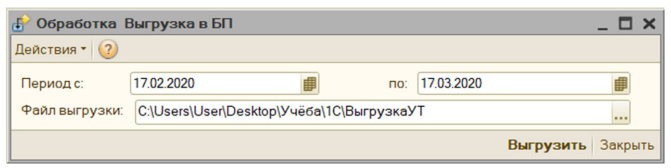

## Результаты

Результаты разработки программного модуля для интеграции данных между системами 1С:Управление торговлей и 1С:Бухгалтерия представлены ниже. Сперва сотрудник открывает систему 1С:Управление торговлей и авторизовывается в ней. Переходит в пункт главного меню «Сервис», откуда появляется выпадающий список, в нём находит элемент «Внешние печатные формы и обработка», далее выбирает «Внешние обработки». Далее открывается форма со всеми внешними обработками предприятия, система предлагает выбрать пользователю нужный объект, сотрудник выбирает «Выгрузка в БП». Далее открывается форма внешней обработки. Пользователь должен указать начало и конец периода, за который должны быть выгружены документы. После этого сотрудник выбирает каталог, где будет сохранен XML файл, в котором хранятся данные выгруженных документов. Выбор каталога возможно осуществить как вручную, так и при помощи диалогового окна (рис. 1).

Рис. 1. Форма выгрузки документов

<!--

-->

Если данные на форме были заполнены корректно, то программный модуль создает и сохранит XML файл с данными документов и выведет окно, сообщающее об успешной операции и количестве выгруженных документов.

Открыв каталог выгрузки, который ранее был выбран на форме внешней обработки, можно увидеть сохраненный файл с данными документов (рисунок 1). В названии файла сохраняется дата и время проведения операции выгрузки информации.

Далее, чтобы загрузить данные, сотрудник авторизовывается и заходит в систему 1С – «Бухгалтерия предприятия». После этого в пункте меню «Администрирование» переходит в раздел «Настройки программы», в нем нажимает на «Печатные формы, отчеты и обработки». После этого находит пункт «Дополнительные отчеты и обработки», по нажатию на который открывается форма со всеми отчетами и обработками, где пользователь увидит внешнюю обработку «Загрузка из УТ». Нажав на неё, откроется первая форма внешней обработки. Здесь пользователь указывает файл выгрузки, с которым будет работать программный модуль (рис. 2).

  
Рис. 2. Форма выбора файла выгрузки

Нажав кнопку «Далее», открывается форма выбора документов для загрузки (рис. 3). В ней перечислена основная информация о выгруженных документов в виде таблицы. У сотрудника есть возможность выбрать все или только необходимые ему документы для загрузки.

Рис. 3. Форма выбора документов для загрузки

Следующим этапом в программном модуле является настройка загруженных данных с уже существующими. Ввиду специфики записи части данных в документ в виде различных объектов конфигураций, настройка загруженных данных гарантирует, что новая информация будет интегрирована в систему правильно и эффективно, поддерживая ее целостность и стабильность. Далее идут формы настройки организаций, контрагентов и банковских счетов на рисунках 4, 5, 7 соответственно. В левых столбцах представлены данные выгруженные из 1С:Управление торговлей, а в правых данные, которые будут использованы в загружаемых документах.

Рис. 4. Форма настройки соответствия организаций

Рис. 5. Форма настройки соответствия контрагентов

Рис. 6. Форма настройки соответствия договоров

Выполнив последний этап настройки соответствия данных и нажав кнопку «Далее», сотрудник видит форму с основной информацией о загруженных документах. В столбце «Реализация в бух.» можно увидеть ссылку с уникальным номером на каждый документ.

Для наглядности представления результатов загрузки ниже приведена сводная таблица с статистикой обработанных документов:

Таблица 1. Статистика обработки документов при интеграции между 1С:УТ и 1С:Бухгалтерия

| Тип документа | Количество | Успешно | С ошибками |
|---------------|------------|---------|------------|
| Платежные ордера: поступление денежных средств | 42 | 40 | 2 |
| Счета-фактуры | 28 | 27 | 1 |
| Накладные | 35 | 34 | 1 |
| Акты выполненных работ | 19 | 18 | 1 |
| **Итого:** | **124** | **119** | **5** |

Как видно из таблицы, большинство документов было обработано успешно. Документы с ошибками требуют дополнительной проверки и могут быть загружены повторно после исправления.

Для наглядности представления результатов загрузки ниже приведена сводная таблица с статистикой обработанных документов:

Таблица 2. Статистика исправленных документов

| Тип документа | Количество | Успешно | С ошибками |
|---------------|------------|---------|------------|
| Платежные ордера: поступление денежных средств | 42 | 42 | 0 |
| Счета-фактуры | 28 | 28 | 0 |
| Накладные | 35 | 35 | 0 |
| Акты выполненных работ | 19 | 19 | 0 |
| **Итого:** | **124** | **124** | **0** |

